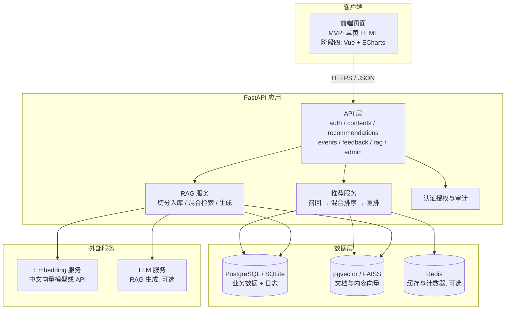
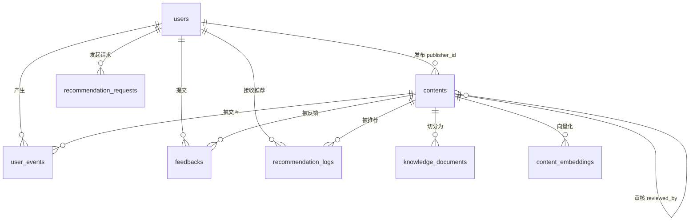
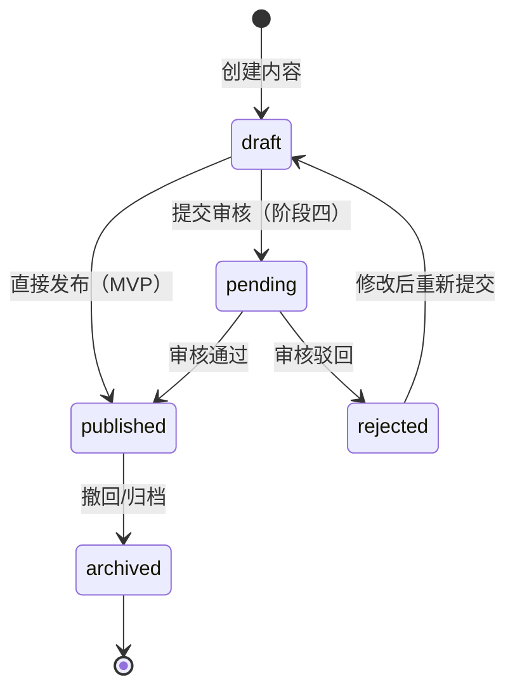
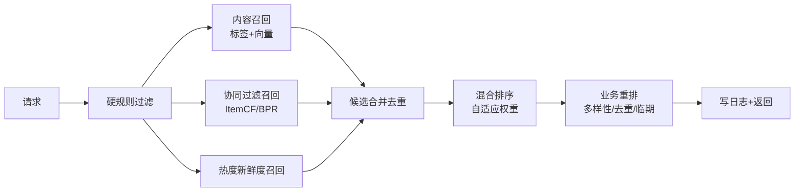

# 校园信息混合推荐系统 · 详细设计文档

| 项目 | 内容 |
| --- | --- |
| 文档版本 | v0.1（草案） |
| 关联文档 | 《校园信息混合推荐系统实施方案》（以下简称"实施方案"） |
| 代码基线 | `app/main.py` v0.1.0、`frontend/index.html`、`tests/test_app.py` |
| 覆盖范围 | 实施方案第 8 节全部四个开发阶段 |
| 文档状态 | 评审中 |

> 本文档是实施方案的细化：实施方案回答"做什么、为什么"，本文档回答"具体怎么做"——表结构、接口契约、算法伪代码、模块划分、部署与测试设计。凡与现有原型不一致之处，均以第 15 节差距清单标注。

---

## 1. 引言

### 1.1 目的与读者

本文档面向参与系统开发、测试、部署的工程师与课程评审人员，用于：

1. 作为编码依据：数据库 DDL、API 契约、算法流程可直接落地；
2. 作为验收依据：第 13 节测试设计与实施方案第 9 节验收标准一一对应；
3. 作为演进依据：第 15 节差距清单是原型 → 完整系统的工作清单。

### 1.2 术语与缩写

| 术语 | 含义 |
| --- | --- |
| ItemCF | 基于物品的协同过滤（Item-based Collaborative Filtering） |
| BPR | Bayesian Personalized Ranking，隐式反馈排序模型 |
| LightFM | 融合内容与协同信号的混合矩阵分解模型 |
| 冷启动 | 用户行为数据不足时，靠内容与热度兜底的推荐状态 |
| MMR | Maximal Marginal Relevance，兼顾相关性与多样性的重排算法 |
| RRF | Reciprocal Rank Fusion，多路检索结果融合算法 |
| RAG | Retrieval-Augmented Generation，检索增强生成 |
| NDCG / MAP | 排序质量指标（归一化折损累计增益 / 平均准确率） |
| ILD | Intra-List Diversity，列表内多样性 |
| P95 | 95 分位延迟，本系统性能验收口径 |
| CTR | 点击率 = 点击 / 曝光 |
| embedding | 文本向量表示 |
| pgvector | PostgreSQL 向量扩展；HNSW 为其中一种向量索引 |
| FAISS | Facebook 开源向量检索库（无 PostgreSQL 时的替代） |
| JWT | JSON Web Token，阶段四认证方案 |
| trace_id | 一次推荐请求的全局唯一标识，用于串联推荐→曝光→行为 |

### 1.3 设计约定

| 约定 | 规则 |
| --- | --- |
| 时间格式 | API 与 SQLite 均使用 ISO 8601 UTC 字符串（`2026-09-01T08:00:00Z`）；PostgreSQL 使用 `TIMESTAMPTZ` |
| JSON 字段 | `interests`、`tags`、`target_roles`、`target_colleges` 在库中存 JSON 数组字符串，API 层直接返回数组 |
| 事件类型 | 库中统一英文枚举：`impression / click / favorite / register / share / dismiss`；API 兼容中文别名（`收藏`→`favorite`、`报名`→`register`，与原型一致） |
| 错误格式 | 遵循 FastAPI 约定：HTTP 状态码 + `{"detail": "..."}`；业务错误码见 4.5 |
| 分页 | `page` 从 1 开始，`page_size` 上限 50 |
| trace_id | UUID4，由 `/recommendations` 生成，随曝光与行为事件回传 |
| 角色取值 | `student / counselor / organizer / admin` |
| 内容类型 | `notice / activity / course / lecture / scholarship / service` |
| 状态机 | `contents.status` 取值与流转见 3.3 |

### 1.4 与实施方案、现有原型的关系

```text
实施方案（做什么/为什么）
        │ 细化
        ▼
本文档（怎么做：DDL / API / 算法 / 部署 / 测试）
        │ 对照
        ▼
第 15 节差距分析（现有原型 → 本文档目标 的逐项工作清单）
```

现有原型已实现实施方案阶段一的大部分能力（登录、发布、混合推荐、行为记录、RAG 雏形），本文档在其 API 路径与表名基础上向前设计，不推倒重来。

---

## 2. 总体设计

### 2.1 系统上下文与架构



- **单体优先**：阶段一~三为单体 FastAPI 进程 + 单数据库；阶段四引入 PostgreSQL/pgvector、Redis 与 Docker Compose，但仍保持单体，不拆微服务。
- **推荐与 RAG 职责分离**：推荐排序负责"推荐什么"，RAG 负责"为什么推荐"与校园问答（见 6.1）。

### 2.2 技术选型（分阶段）

| 组件 | 选型 | 版本/说明 | 生效阶段 |
| --- | --- | --- | --- |
| Web 框架 | FastAPI + Pydantic v2 | 现有原型已用 | 一 |
| 数据访问 | SQLAlchemy 2.x + Alembic | 原型目前为原生 `sqlite3`，阶段四迁移 | 四 |
| 数据库 | 开发：SQLite；生产：PostgreSQL 16 | `CAMPUS_DB` / `DATABASE_URL` 切换 | 一 / 四 |
| 向量检索 | 开发：numpy/FAISS（内存）；生产：pgvector | 归一化后内积即余弦 | 二 / 四 |
| 内容向量 | TF-IDF（char 2-4 gram，原型已有）→ 中文 Embedding 模型 | 首选 `BAAI/bge-small-zh-v1.5`（512 维）或外部 API，模型名入配置 | 二 |
| 协同过滤 | ItemCF（numpy 实现）→ implicit（BPR） | 行为量阈值控制启用，见 5.4 | 二 |
| 关键词检索 | 开发：char-bigram 匹配（原型已有）；生产：jieba + BM25 或 FTS5 trigram | — | 三 |
| LLM | 外部 API（通义/DeepSeek/智谱等，配置化），**不训练、不微调** | 缺省配置下可离线运行模板式回答（原型现状） | 三 |
| 前端 | MVP：无构建单页 `frontend/index.html`；目标：Vue 3 + Vite + Element Plus + ECharts | — | 一 / 二~四 |
| 缓存 | Redis 7 | 推荐结果与热度计数缓存 | 四（可选，二起可用进程内缓存替代） |
| 部署 | Docker Compose（app + db + redis + nginx） | 见第 12 节 | 四 |
| 任务调度 | APScheduler（进程内）→ 系统 cron | 重训、索引重建、日志清理 | 四 |
| 测试 | pytest + TestClient | 现有 `tests/test_app.py` | 一 |

### 2.3 模块划分与职责

目标后端包结构（阶段二完成骨架，阶段三、四填充）：

```text
app/
├── main.py                    # 入口：创建应用、注册路由与中间件、启动钩子
├── config.py                  # 环境变量与配置（见 12.1）
├── db.py                      # 引擎/会话（SQLAlchemy）、SQLite→PG 兼容层
├── models/                    # ORM 模型（对应第 3 节各表）
│   ├── user.py
│   ├── content.py
│   ├── event.py
│   └── knowledge.py
├── schemas/                   # Pydantic 请求/响应模型（API 契约的唯一来源）
├── security/                  # 认证（demo token / JWT）、权限依赖、审计
├── api/                       # 路由层，只做参数校验与响应组装
│   ├── auth.py
│   ├── contents.py
│   ├── recommendations.py
│   ├── events.py
│   ├── rag.py
│   └── admin.py
├── services/
│   ├── recommender/
│   │   ├── pipeline.py        # 流水线编排（5.1）
│   │   ├── recall_content.py  # 内容召回（5.3）
│   │   ├── recall_cf.py       # 协同过滤（5.4）
│   │   ├── recall_hot.py      # 热度/新鲜度（5.5）
│   │   ├── blend.py           # 混合排序与权重自适应（5.6）
│   │   ├── rerank.py          # 业务重排（5.7）
│   │   └── reason.py          # 推荐理由（5.8）
│   ├── rag/
│   │   ├── chunker.py         # 文档切分（6.2）
│   │   ├── indexer.py         # 向量化与入库（6.3）
│   │   ├── retrieve.py        # 查询改写 + 混合检索（6.4/6.5）
│   │   ├── generate.py        # LLM 生成与拒答（6.6）
│   │   └── explain.py         # 推荐解释（6.7）
│   └── metrics.py             # 统计指标计算（第 8 节）
└── middleware/
    ├── latency.py             # 请求耗时统计（P95 数据来源）
    └── trace.py               # trace_id 注入与传播
scripts/
├── seed_data.py               # 种子内容与演示用户（第 9 节）
├── simulate_events.py         # 模拟行为生成（第 9 节）
├── offline_eval.py            # 离线评估（5.10）
├── retrain_cf.py              # 协同过滤矩阵重建（5.11）
└── clear_simulated.py         # 上线前清理模拟数据（第 9 节）
tests/
└── ...                        # 对应第 13 节测试清单
```

职责规则：

1. API 层不写算法逻辑；推荐与 RAG 全部在 `services/`；
2. 数据库访问只经 ORM 层；`recommendation_logs` 写入由 `pipeline.py` 统一负责；
3. 任何配置差异（模型名、阈值、权重）一律走 `config.py`，不在业务代码中散落魔法数。

### 2.4 关键流程时序

**推荐请求**：

```text
GET /recommendations
  → 鉴权，加载用户画像与行为
  → 候选召回（多通道并行执行，各自 top-30）
  → 合并去重 → 混合排序（自适应权重）
  → 业务重排（过期/多样性/去重/临期）
  → 写 recommendation_logs + recommendation_requests
  → 返回 items + trace_id
```

**RAG 问答**：

```text
POST /rag/ask
  → 鉴权 → 查询改写
  → 向量检索（pgvector/FAISS）+ 关键词检索 并行
  → RRF 融合 → 权限过滤 → 重排取 top-k
  → 评分低于阈值？→ 拒答话术（无依据）
  → LLM 生成（仅依据检索片段，带引用编号）
  → 缓存 {answer_id → sources}，返回 answer + sources + answer_id
```

**行为闭环**：

```text
前端曝光/点击/收藏/报名 → POST /events（带 trace_id）
  → 事件入库（simulated 标记、去重、报名唯一约束）
  → 触发缓存失效 / 协同矩阵增量更新（延迟批处理）
  → 下次推荐生效（dismiss 过滤、已报名剔除、热度变化）
```

---

## 3. 数据库设计

### 3.1 ER 图



### 3.2 表与字段说明

> 完整 DDL 见附录 A（PostgreSQL，目标态）与附录 B（SQLite，开发态）。下文"类型"列为 PostgreSQL 类型；SQLite 差异：`BIGSERIAL`→`INTEGER PRIMARY KEY AUTOINCREMENT`、`TIMESTAMPTZ`→`TEXT`（ISO 8601）、`JSONB`→`TEXT`（JSON 字符串）、`vector`→`TEXT`（JSON 数组）或 BLOB。

#### 3.2.1 users（用户）

| 字段 | 类型 | 约束/说明 |
| --- | --- | --- |
| id | BIGSERIAL | 主键 |
| username | TEXT | 唯一；**阶段四启用**（JWT 登录），MVP 为空 |
| password_hash | TEXT | bcrypt 哈希；**阶段四启用** |
| name | TEXT | 必填，显示名 |
| role | TEXT | 必填，`student/counselor/organizer/admin` |
| college | TEXT | 院系，默认空串 |
| major | TEXT | 专业，默认空串 |
| grade | TEXT | 年级（如"大二"），默认空串 |
| interests | JSONB | 兴趣标签数组，默认 `[]` |
| is_active | BOOLEAN | 默认 true（停用账号不参与推荐） |
| created_at | TIMESTAMPTZ | 默认 now() |

#### 3.2.2 contents（信息内容）

| 字段 | 类型 | 约束/说明 |
| --- | --- | --- |
| id | BIGSERIAL | 主键 |
| title | TEXT | 必填，2–200 字 |
| body | TEXT | 必填，≥5 字 |
| content_type | TEXT | 六类枚举，见 1.3 |
| publisher_id | BIGINT | 外键 users.id |
| target_roles | JSONB | 可见角色数组；空数组 = 所有角色可见 |
| target_colleges | JSONB | 定向院系数组；空数组 = 全院校 |
| tags | JSONB | 标签数组 |
| start_time | TIMESTAMPTZ | 可空（活动/讲座开始时间） |
| end_time | TIMESTAMPTZ | 可空（报名/截止时间；过期过滤依据） |
| publish_time | TIMESTAMPTZ | 必填，默认 now() |
| status | TEXT | 状态机见 3.3，默认 `published` |
| reviewed_by | BIGINT | 可空，审核人（阶段四启用） |
| reviewed_at | TIMESTAMPTZ | 可空，审核时间 |

> 实施方案中的 `embedding_id` 字段取消，由 `content_embeddings` 表独立管理（支持多模型、多版本向量）。

#### 3.2.3 user_events（用户行为）

| 字段 | 类型 | 约束/说明 |
| --- | --- | --- |
| id | BIGSERIAL | 主键 |
| user_id | BIGINT | 外键 users.id |
| content_id | BIGINT | 外键 contents.id |
| event_type | TEXT | 六类枚举，见 1.3 |
| source | TEXT | `recommendation/search/homepage`，默认 `homepage` |
| simulated | BOOLEAN | 模拟数据标记，默认 false（第 9 节） |
| trace_id | TEXT | 可空，串联推荐曝光链路 |
| timestamp | TIMESTAMPTZ | 默认 now() |

**唯一约束**：`(user_id, content_id)` 部分唯一索引，条件 `event_type='register'`——同一用户对同一内容只能报名一次；其余事件可重复（点击多次合法）。

**行为权重**（与原型 `EVENT_WEIGHTS` 一致）：

| 事件 | 权重 |
| --- | --- |
| click | 1.0 |
| favorite（收藏） | 3.0 |
| register（报名） | 5.0 |
| share | 4.0 |
| impression | 0.1 |
| dismiss | -2.0 |

#### 3.2.4 recommendation_logs（推荐明细日志）

| 字段 | 类型 | 约束/说明 |
| --- | --- | --- |
| id | BIGSERIAL | 主键 |
| user_id | BIGINT | 外键 |
| content_id | BIGINT | 外键 |
| rank | INTEGER | 展示位次（1 起） |
| recall_source | TEXT | 召回来源标记，见 5.8 |
| score | DOUBLE PRECISION | 混合排序得分 |
| trace_id | TEXT | 必填，同次请求共享 |
| shown_at | TIMESTAMPTZ | 默认 now() |

#### 3.2.5 recommendation_requests（推荐请求汇总，阶段一新增）

| 字段 | 类型 | 约束/说明 |
| --- | --- | --- |
| id | BIGSERIAL | 主键 |
| trace_id | TEXT | 必填，唯一 |
| user_id | BIGINT | 外键 |
| item_count | INTEGER | 本次返回条数（0 = 空结果） |
| latency_ms | INTEGER | 接口耗时，P95 数据来源 |
| requested_at | TIMESTAMPTZ | 默认 now() |

> 该表支撑"空结果率"与"P95 延迟"两个验收指标（实施方案 9 节），原型缺失，见差距 8。

#### 3.2.6 feedbacks（用户反馈）

| 字段 | 类型 | 约束/说明 |
| --- | --- | --- |
| id | BIGSERIAL | 主键 |
| user_id | BIGINT | 外键 |
| content_id | BIGINT | 外键 |
| feedback_type | TEXT | `not_interested/outdated/inaccurate/other` |
| reason | TEXT | 可空，补充说明 |
| created_at | TIMESTAMPTZ | 默认 now() |

#### 3.2.7 knowledge_documents（RAG 文档块）

| 字段 | 类型 | 约束/说明 |
| --- | --- | --- |
| id | BIGSERIAL | 主键 |
| source_content_id | BIGINT | 可空外键 contents.id（校园资料）；可存独立办事流程文档 |
| title | TEXT | 来源标题 |
| text | TEXT | 切分后的文本块（200–500 字） |
| chunk_index | INTEGER | 块序号，`(source_content_id, chunk_index)` 唯一 |
| embedding | vector | 向量（维度随模型，默认 768） |
| embed_model | TEXT | 向量模型名，版本管理用 |
| updated_at | TIMESTAMPTZ | 默认 now() |

#### 3.2.8 content_embeddings（内容向量，阶段二）

| 字段 | 类型 | 约束/说明 |
| --- | --- | --- |
| id | BIGSERIAL | 主键 |
| content_id | BIGINT | 外键 contents.id，级联删除 |
| embed_model | TEXT | 模型名，`(content_id, embed_model)` 唯一 |
| embedding | vector | 标题+正文+标签拼接后的向量 |
| updated_at | TIMESTAMPTZ | 默认 now() |

#### 3.2.9 audit_logs（审计日志，阶段四）

| 字段 | 类型 | 约束/说明 |
| --- | --- | --- |
| id | BIGSERIAL | 主键 |
| actor_id | BIGINT | 可空，操作者 |
| action | TEXT | `content.create / content.publish / content.delete / auth.login / ...` |
| resource | TEXT | 资源标识，如 `contents:123` |
| detail | JSONB | 变更摘要（旧值/新值关键字段） |
| ip | TEXT | 来源 IP |
| created_at | TIMESTAMPTZ | 默认 now() |

### 3.3 内容状态机



- MVP（阶段一~三）：`draft → published`，创建即发布（与原型一致）；保留 `archived` 用于下架。
- 阶段四：启用 `pending/rejected` 审核环节；`POST /contents/{id}/submit` 触发。

### 3.4 索引与约束汇总

| 表 | 索引/约束 | 目的 |
| --- | --- | --- |
| contents | `(status, content_type)` | 列表与召回过滤 |
| contents | `end_time` | 过期过滤 |
| contents | `publisher_id` | 发布者查询 |
| user_events | `(user_id, timestamp DESC)` | 用户行为时间线 |
| user_events | `(content_id, event_type)` | 热度统计、ItemCF 矩阵构建 |
| user_events | 部分唯一 `(user_id, content_id) WHERE event_type='register'` | 防重复报名 |
| recommendation_logs | `(user_id, shown_at DESC)` | 推荐历史 |
| recommendation_logs | `trace_id` | 链路串联 |
| recommendation_requests | `trace_id` 唯一、`(requested_at)` | 指标计算 |
| knowledge_documents | HNSW `(embedding vector_cosine_ops)` | 向量检索 |
| content_embeddings | HNSW `(embedding vector_cosine_ops)`、`(content_id, embed_model)` 唯一 | 内容召回 |

### 3.5 SQLite → PostgreSQL 迁移策略

1. 阶段一~三使用 SQLite，路径由 `CAMPUS_DB` 指定（原型已支持）；
2. 阶段四引入 SQLAlchemy + Alembic：以第 3.2 节模型为唯一来源生成迁移脚本；现有 SQLite 数据用 `scripts/migrate_sqlite_to_pg.py` 导入（逐表拷贝 + JSON 字段转 JSONB + 重置自增序列）；
3. 类型映射按 3.2 节说明执行；`vector` 列在 pgvector 扩展启用后创建；
4. 切换后 `CAMPUS_DB` 仅作为测试隔离用，生产强制 `DATABASE_URL`。

### 3.6 数据保留与删除

| 数据 | 策略 |
| --- | --- |
| user_events | 保留 180 天明细；更早数据按 (user, content, event_type) 聚合后删除明细 |
| recommendation_logs | 保留 90 天，之后抽样归档（10%） |
| knowledge_documents / content_embeddings | 随源内容更新重建，旧模型版本保留一个版本用于 A/B |
| 用户退出 | `DELETE /me/data`：删除该用户全部 user_events、feedbacks、recommendation_logs，users 行匿名化（name 置"已注销用户"，interests 清空） |

---

## 4. API 详细设计

### 4.1 通用约定

- Base URL：开发 `http://127.0.0.1:8000`；生产经 nginx `/api` 前缀反代（12.2）。
- 鉴权：请求头 `Authorization: Bearer <token>`；唯一例外 `POST /auth/login`。
- 成功响应：直接返回业务 JSON（与原型一致），不使用统一信封；失败响应：`{"detail": "..."}`。
- 时间一律 ISO 8601 UTC 字符串。

### 4.2 认证与授权设计

| 阶段 | 方案 | 说明 |
| --- | --- | --- |
| MVP（现状） | 演示令牌 | `POST /auth/login {user_id}` 返回 `demo-<id>`；仅限开发与演示 |
| 阶段四 | JWT | `username + password`（bcrypt）→ 签发 HS256 JWT：`{sub, role, exp}`，有效期 2h；refresh token 7d；`user_from_token` 依赖改为 JWT 校验 + `is_active` 检查 |

中间层权限依赖：

```python
def require_roles(*roles):
    def dep(user = Depends(user_from_token)):
        if user["role"] not in roles:
            raise HTTPException(403, "无权访问")
        return user
    return dep
```

资源级权限单独校验（发布者编辑、审核人操作等，见 4.6）。

### 4.3 接口总表

| 方法 | 路径 | 角色 | 说明 | 阶段 |
| --- | --- | --- | --- | --- |
| POST | /auth/login | 公开 | 登录换令牌 | 一 |
| GET | /me | 登录用户 | 当前用户信息 | 一 |
| GET | /contents | 登录用户 | 内容列表（类型过滤、角色可见过滤） | 一 |
| POST | /contents | counselor/organizer/admin | 创建内容（草稿或直接发布） | 一 |
| GET | /contents/{id} | 登录用户 | 内容详情（带可见性校验） | 一 |
| PUT | /contents/{id} | 发布者本人/admin | 编辑内容 | 一（差距 1） |
| POST | /contents/{id}/publish | 发布者本人/admin | 发布/上架 | 一 |
| POST | /contents/{id}/submit | 发布者本人 | 提交审核（draft→pending） | 四 |
| GET | /recommendations | 登录用户 | 个性化推荐 | 一 |
| POST | /events | 登录用户 | 行为上报 | 一 |
| POST | /feedback | 登录用户 | 反馈上报 | 一 |
| POST | /activities/{id}/register | 登录用户 | 活动报名 | 一 |
| POST | /rag/ask | 登录用户 | 校园问答 | 三 |
| POST | /rag/explain | 登录用户 | 推荐解释 | 三（差距 12） |
| GET | /rag/sources/{answer_id} | 登录用户 | 查询答案引用来源 | 三 |
| GET | /admin/metrics | counselor/organizer/admin | 统计指标 | 一 |
| GET | /admin/recommendation-logs | counselor/organizer/admin | 推荐日志查询 | 一（差距 7） |
| DELETE | /me/data | 登录用户 | 删除/匿名化本人数据 | 四（隐私） |
| GET | /health | 公开 | 健康检查 | 一 |

### 4.4 接口明细

#### 4.4.1 认证与用户

**POST /auth/login**

```json
// 请求（MVP）
{ "user_id": 1 }
// 请求（阶段四）
{ "username": "zhang", "password": "******" }
// 响应
{
  "access_token": "demo-1",
  "token_type": "bearer",
  "user": { "id": 1, "name": "张同学", "role": "student", "college": "计算机学院", "major": "软件工程", "grade": "大二", "interests": ["人工智能","志愿服务","创新创业"] }
}
```

错误：404 用户不存在 / 401 密码错误。

**GET /me** → 返回当前用户对象（同上 `user` 结构）。

#### 4.4.2 内容管理

**GET /contents**　参数：`content_type`（可选）。返回当前角色可见的已发布内容（按 `publish_time DESC`）。

**POST /contents**

```json
// 请求
{
  "title": "校园创新创业讲座",
  "body": "邀请创业导师分享项目孵化、商业计划书和竞赛经验……",
  "content_type": "lecture",
  "target_roles": ["student"],
  "target_colleges": ["计算机学院"],
  "tags": ["创新创业", "讲座"],
  "start_time": "2026-09-15T18:00:00Z",
  "end_time": "2026-09-20T18:00:00Z"
}
```

校验：标题 2–200 字、正文 ≥5 字、`content_type` 与 `target_roles` 枚举合法。返回创建后的完整内容对象。

**PUT /contents/{id}**　请求体同 POST。权限：`admin` 或 `publisher_id == user.id`（否则 403）。更新成功后：若 `title/body/tags` 变更，标记该内容 embedding 失效，异步重算（阶段二起）。

**POST /contents/{id}/publish**　将 `draft/archived` 置为 `published`；权限同上。返回 `{"status": "published"}`。

#### 4.4.3 推荐

**GET /recommendations**　参数：

| 参数 | 类型 | 默认 | 说明 |
| --- | --- | --- | --- |
| page | int | 1 | ≥1 |
| page_size | int | 10 | 1–50 |
| content_type | str | 无 | 可选，只看某一类型 |
| refresh | bool | false | true 时绕过缓存强制重算 |

响应（字段与原型一致并补充）：

```json
{
  "items": [
    {
      "content_id": 1,
      "title": "校园创新创业讲座",
      "content_type": "lecture",
      "score": 0.8731,
      "reason": "与你关注的创新创业主题相关",
      "deadline": "2026-09-20T18:00:00Z",
      "tags": ["创新创业", "讲座"],
      "publisher": "王组织"
    }
  ],
  "page": 1,
  "page_size": 10,
  "trace_id": "3f2c...uuid"
}
```

- `content_type` 过滤发生在召回之后、排序之前（保证候选池足够大）。
- 空结果允许（`items: []`），但计入空结果率指标；冷启动配置下（第 9 节）必须保证非空。

#### 4.4.4 行为与反馈

**POST /events**

```json
{ "content_id": 1, "event_type": "click", "source": "recommendation", "trace_id": "3f2c..." }
```

处理：事件类型中文别名映射；`trace_id` 可空；同 `(user, content)` 的 `impression` 10 分钟内去重；`register` 受唯一约束（重复报名返回 409）。返回 `{"status": "recorded"}`。

**POST /feedback**　`{ "content_id": 1, "feedback_type": "not_interested", "reason": "与我无关" }`。`not_interested` 同时写一条 `dismiss` 事件（影响后续推荐过滤）。

**POST /activities/{id}/register**　仅 `content_type='activity'` 可报名（否则 400）；等价于记录 `register` 事件（`source='recommendation'`），成功后返回 `{"status": "registered", "message": "报名成功，已记录到你的兴趣反馈"}`。

#### 4.4.5 RAG

**POST /rag/ask**

```json
// 请求
{ "question": "奖学金申请截止到什么时候？" }
// 响应（有依据）
{
  "answer": "2026 年度奖学金申请的截止日期为 10 月 20 日[1]。",
  "answer_id": "a1b2...",
  "grounded": true,
  "sources": [
    { "content_id": 2, "title": "2026年度奖学金申请通知", "snippet": "……截止日期为10月20日……", "score": 0.82 }
  ]
}
// 响应（无依据）
{ "answer": "未找到可靠的校园资料，请尝试更具体的关键词，或联系辅导员。", "answer_id": null, "grounded": false, "sources": [] }
```

**POST /rag/explain**　`{ "content_id": 1, "trace_id": "3f2c..." }` → `{ "answer": "推荐理由：你近期收藏了……", "sources": [...] }`。流程见 6.7。

**GET /rag/sources/{answer_id}** → 从缓存取 `{ "sources": [...] }`；缓存过期（TTL 24h）返回 404。

#### 4.4.6 管理端

**GET /admin/metrics** → 见第 8 节指标定义；响应示例：

```json
{
  "content_count": 156,
  "event_count": 4123,
  "recommendation_impressions": 9876,
  "ctr": 0.083,
  "register_rate": 0.021,
  "empty_result_rate": 0.0,
  "p95_latency_ms": 312,
  "event_breakdown": [ { "event_type": "click", "count": 3011 }, ... ]
}
```

**GET /admin/recommendation-logs**　参数：`user_id / content_id / from / to / trace_id / limit(≤200)`，返回明细列表（含 rank、score、recall_source、shown_at）。

### 4.5 错误码

| HTTP | 场景 |
| --- | --- |
| 400 | 参数语义错误（如对非活动内容报名） |
| 401 | 未登录 / 令牌无效或过期 |
| 403 | 已登录但无权限（角色不符、非本人内容） |
| 404 | 资源不存在（内容、用户、answer_id） |
| 409 | 重复报名等唯一约束冲突 |
| 422 | 请求体校验失败（FastAPI 默认） |
| 429 | RAG 接口限流（默认 10 次/分钟/用户，阶段四） |
| 500 | 未捕获异常（记录 trace 日志，响应不含堆栈） |

### 4.6 权限矩阵

| 接口 | student | counselor | organizer | admin |
| --- | :-: | :-: | :-: | :-: |
| POST /auth/login, GET /health | ✓ | ✓ | ✓ | ✓ |
| GET /me | ✓ | ✓ | ✓ | ✓ |
| GET /contents, GET /contents/{id} | ✓（可见范围） | ✓ | ✓ | ✓ |
| POST /contents | ✗ | ✓ | ✓ | ✓ |
| PUT /contents/{id}, POST /contents/{id}/publish | ✗ | 仅本人 | 仅本人 | ✓ |
| GET /recommendations | ✓ | ✓ | ✓ | ✓ |
| POST /events, /feedback, /activities/{id}/register | ✓ | ✓ | ✓ | ✓ |
| POST /rag/ask, /rag/explain, GET /rag/sources/{id} | ✓ | ✓ | ✓ | ✓ |
| GET /admin/metrics | ✗ | ✓ | ✓ | ✓ |
| GET /admin/recommendation-logs | ✗ | ✓（本角色发布内容） | ✓（本角色发布内容） | ✓ |
| DELETE /me/data | ✓ | ✓ | ✓ | ✓ |

---

## 5. 推荐服务详细设计

### 5.1 流水线总览



各通道独立取 top-30，合并后统一进入混合排序；单通道失败（如向量服务不可用）时降级跳过，不影响其他通道。

### 5.2 硬规则过滤（召回前置）

按序执行，任一不满足即剔除：

1. `status = 'published'`；
2. **过期过滤**：`end_time` 非空且 `end_time < now` → 剔除（**原型缺失此检查，见差距 3，为高优先级修复**）；
3. 角色可见：`target_roles` 非空且不含当前角色 → 剔除；
4. 院系定向：`target_colleges` 非空且不含当前院系 → 剔除；
5. 已报名：该用户存在 `register` 事件 → 剔除；
6. 明确不感兴趣：近 30 天存在 `dismiss` 事件或 `feedback_type='not_interested'` → 剔除；
7. `is_active = false` 用户跳过整个推荐流程（返回空）。

### 5.3 内容召回（content_recall）

分两档实现：

**MVP（原型已有）：标签 + TF-IDF**

```text
1. 标签分: tag_score = |interests(u) ∩ tags(c)| / max(1, |interests(u)|)
2. 文本分: 对 {标题+正文+标签} 语料做 TF-IDF（char 2-4 gram），
   以用户 interests 拼接文本为查询向量，取余弦相似度 vector_score
3. content_score = max(tag_score, vector_score)
```

**阶段二：Embedding 向量**

```text
1. 文本拼接: title + "。" + body + "。" + " ".join(tags)
2. 向量化: embedding = EMB(text)  （bge-small-zh-v1.5，512 维，L2 归一化）
3. 入库 content_embeddings(content_id, embed_model, embedding)
4. 用户查询向量: EMB(interests + 学院 + 年级 + 近期行为过的内容标题×3)
5. content_score = cosine(query_emb, content_emb)，取 top-30
```

内容更新（PUT）后异步重建该内容向量；批量任务每日扫描 `updated_at` 晚于向量生成时间的内容。

### 5.4 协同过滤召回（cf_recall）

**ItemCF 算法（阶段二首选，纯 numpy 可离线算好快照）**：

```text
输入: 行为表 user_events（simulated=false），事件权重 w
1. 构建用户-内容偏好矩阵 P[u][i] = Σ w(event_type)，并对 P 做 log1p 平滑
2. 内容相似度: S[i][j] = cosine(P[:,i], P[:,j])，每内容仅保留 top-50 相似项
3. 用户 u 对候选 i 的协同分:
   cf(u,i) = Σ_{j ∈ history(u)} w_j · S[i][j] / (Σ_j |S[i][j]| + ε)
   （history(u) 为用户正向行为内容：click/favorite/register/share）
4. 剔除用户已交互内容，输出 top-30
```

**升级路径（阶段二末~四）**：行为矩阵规模 > 10 万事件时，改用 `implicit` 库 BPR 模型，每天凌晨离线训练，序列化模型快照供在线加载；ItemCF 结果保留为可解释兜底。

**启用条件**：`|history(u)| ≥ N_cf`（默认 10）才输出该通道；低于阈值时该通道权重为 0（见 5.6），保证冷启动不受噪声协同影响。

### 5.5 热度与新鲜度召回（hot_recall）

```text
popularity(c) = log2(1 + Σ w(event))        # 近 7 天事件加权，全站归一化到 [0,1]
freshness(c)  = exp(-age_days / 14)          # 半衰期 14 天，与原型一致
hot_score     = 0.7 · popularity_norm + 0.3 · freshness
```

- 同院系内容额外 ×1.2（"同院系热门"）。
- 该通道的另一个作用是保证新内容曝光：`impression_count < 20` 的新内容强制进入候选池（冷启动保护，见 5.7）。

### 5.6 混合排序与冷启动自适应

各通道分项分数先做 min-max 归一化（以当前候选池为分母），再加权：

```text
n = 用户有效行为数（dismiss 不计，log 平滑）
p = min(1, n / 10)                       # 冷启动 → 行为充足 的过渡系数

w_content = 0.55 − 0.25·p
w_cf      = 0.40·p
w_fresh   = 0.10·p
w_pop     = 0.25 − 0.15·p
w_role    = 0.20 − 0.10·p                # 权重恒为 1（设计保证）

final_score = w_content·s_content + w_cf·s_cf + w_fresh·s_fresh
            + w_pop·s_pop + w_role·s_role
```

两端点值与实施方案一致：

| 状态 | content | cf | fresh | pop | role |
| --- | --- | --- | --- | --- | --- |
| 冷启动（n=0） | 0.55 | 0 | 0 | 0.25 | 0.20 |
| 行为充足（n≥10） | 0.30 | 0.40 | 0.10 | 0.10 | 0.10 |

`role_match`：内容定向当前角色 → 1.0；未定向（全角色）→ 0.5；按角色类型偏好微调（辅导员对 `notice/scholarship/service`、组织者对 `course/activity` 的 role 分 ×1.2，见实施方案 4.3）。

### 5.7 重排序与业务规则

按序执行（`rerank.py`）：

```text
1. 过期强制过滤（end_time 已过 → 剔除；5.2 双保险）
2. 已报名剔除；已读（click 过）与 dismiss → score ×0.5
3. 同一发布者连续限制：滑动窗口内同一 publisher 内容至多 2 条
4. 类型多样性（MMR，λ=0.8）：
   mmr(i) = λ·score(i) − (1−λ)·dup(i, selected)
   dup = 1 若 i 的类型已出现在最近 3 条选中结果中，否则 0
   → 保证 top-10 至少 3 种类型（验收指标）
5. 活动临期提升：content_type='activity' 且 0 < end_time − now < 48h → score ×1.1
6. 新内容曝光保护：impression_count < 20 → score += 0.05·(1 − impression_count/20)
7. 截断 top-k（k = page × page_size），分页在内存完成
```

### 5.8 推荐理由生成

`recall_source` 标记 = 最终得分最高的通道；理由模板（附录 C 全量）：

| 触发条件 | reason 模板 |
| --- | --- |
| 标签命中 | 与你关注的「{命中标签}」主题相关 |
| 向量相似且行为充足 | 与你{收藏/报名}过的《{相似内容标题}》内容相近 |
| 协同通道得分最高 | 与你兴趣相近的同学也在关注 |
| 热度/新鲜度 | {同院系}同学近期热门 / 近期新发布 |
| 角色定向 | 与你{角色}身份相关的校园事务信息 |

阶段三起，`POST /rag/explain` 将上述理由 + 原文证据片段组合为完整解释（6.7）。

### 5.9 日志与 trace_id

- 每次请求生成 `trace_id`（UUID4）；
- `recommendation_logs` 按返回的每一条写入（rank、score、recall_source）；
- `recommendation_requests` 按请求写入一条（item_count、latency_ms、trace_id）；
- 前端上报 `impression/click` 时回传 `trace_id`，实现"推荐 → 曝光 → 行为"闭环（第 8 节 CTR 计算依据）。

### 5.10 离线评估设计

`scripts/offline_eval.py`：

1. **切分**：按时间留出法——取时间轴最后 20% 行为作为测试集，其余训练；
2. **回放**：对每个测试用户，用训练集行为重建画像与协同矩阵，生成 top-K（K=10）推荐；
3. **指标**（与实施方案 9 节对应）：

| 指标 | 公式/口径 |
| --- | --- |
| Precision@K | 命中测试集正向行为的内容数 / K |
| Recall@K | 命中数 / 测试集正向行为内容数 |
| NDCG@K | 相关性增益 = 行为权重（click 1 / favorite 3 / register 5），`DCG = Σ rel_i / log2(i+1)` |
| MAP@K | 各用户 AP@K 均值 |
| 覆盖率 | 推荐列表覆盖的不同内容数 / 全库内容数 |
| ILD 多样性 | 列表内两两内容类型的平均差异度（1 − Jaccard） |
| 新颖性 | 1 − 推荐内容平均流行度分位 |

4. **输出**：`reports/eval_YYYYMMDD.md`（指标表 + 分角色对比），作为每次算法改动的基线对比；
5. **基线目标**：模拟数据集上 P@10 ≥ 0.3、覆盖率 ≥ 60%、top-10 类型数 ≥ 3（说明性目标，随真实数据校准）。

### 5.11 模型训练与定期重训

| 任务 | 频率 | 说明 |
| --- | --- | --- |
| ItemCF 相似度快照 | 每日凌晨 | 读当日行为，重算 S[i][j]，保存 numpy 快照；在线加载，无停机 |
| BPR 模型训练 | 每周（行为量达标后） | `scripts/retrain_cf.py`，模型文件带日期版本 |
| 内容向量重建 | 内容变更触发 + 每日扫描 | 见 5.3 |
| 日志清理 | 每日 | 按 3.6 保留策略 |

阶段一~三用 APScheduler 进程内调度；阶段四迁到宿主机 cron / 独立 worker 容器。

---

## 6. RAG 详细设计

### 6.1 职责边界

| 职责 | 接口 | 说明 |
| --- | --- | --- |
| 推荐解释 | POST /rag/explain | "为什么推荐"：排序证据 + 原文片段 |
| 校园问答 | POST /rag/ask | 事务问答：报名截止、申请条件、办事流程等 |

RAG **不参与**推荐排序（排序由第 5 节完成），只消费排序证据与检索原文。禁止模型输出检索资料之外的内容（6.6 拒答）。

### 6.2 文档切分与入库

```text
输入: contents（status='published'）+ 手工导入的办事流程文档
切分: 按标题层级/空行聚合段落，目标块长 200–500 字，
      相邻块重叠 50 字（保留上下文），chunk_index 顺序编号
元数据: title、source_content_id、content_type、target_roles、
        target_colleges、publish_time 写入 knowledge_documents
入库: 批量向量化（batch=32）→ 写入 embedding 字段
触发: 内容发布/更新时异步执行；全量重建脚本每日可选执行
```

### 6.3 向量化与索引

| 环境 | 方案 |
| --- | --- |
| 开发（SQLite） | embedding 存 TEXT（JSON 数组）；启动时加载到内存 numpy 矩阵 + FAISS `IndexFlatIP`（向量 L2 归一化后内积=余弦） |
| 生产（PostgreSQL） | pgvector：`vector(768)` 列 + HNSW 索引（`m=16, ef_construction=64`），检索 `ef_search=40` |

Embedding 模型配置项 `EMBEDDING_MODEL`（默认 `BAAI/bge-small-zh-v1.5`，或外部 API）；`embed_model` 字段记录来源，模型升级时双版本并存、灰度切换。

### 6.4 查询改写

两级实现，可独立开关：

1. **规则改写（MVP，无 LLM）**：
   - 意图分类：`deadline / eligibility / location / process / other`（关键词表 + 正则）；
   - 关键词抽取：日期（`\d+月\d+日`、`截止`）、地点（`图书馆/教学楼/线上`）、专名（奖学金/选课/宿舍/请假）；
   - 产出：原问题 + 扩展关键词列表。
2. **LLM 改写（阶段三可选）**：用轻量提示词将口语问题改写为检索式查询，输出仅用于检索，不直接作答。

### 6.5 混合检索与融合

```text
通道 A（语义）: query_emb = EMB(改写后问题)
               → 向量检索 top-20（过滤 target_roles/colleges 权限）
通道 B（关键词）: 开发: char-bigram 重合度（原型已有）
               生产: jieba 分词 + BM25（或 FTS5 trigram）→ top-20
融合: RRF   score(d) = Σ_c 1/(60 + rank_c(d))     （k=60）
重排: 按 RRF 得分 + 发布时间衰减(0.98^days) 微调，取 top-k（默认 3）
```

### 6.6 生成与拒答

```text
1. 取检索 top-k 片段，若:
   - 通道 B 无任何命中 且 通道 A 最高余弦 < 0.30  → 拒答
2. 组装提示词（附录 D 模板）：system 限定"只依据资料作答，禁止编造"，
   user 含【资料】编号片段 + 【问题】
3. LLM 生成（temperature=0.2），要求引用编号 [1][2]
4. 无 LLM 配置时降级为模板式回答（原型现状）:
   "根据《{title}》：{snippet}"
5. 返回 { answer, answer_id, grounded, sources }
```

拒答话术（固定）：`"未找到可靠的校园资料，请尝试更具体的关键词，或联系辅导员。"`

### 6.7 推荐解释（POST /rag/explain）

```text
输入: content_id + trace_id（可选）
1. 取 recommendation_logs 中该 (user, content) 的 score 与 recall_source；
   无记录时按 5.8 规则实时重算触发条件
2. 收集证据:
   - 标签命中: 用户 interests ∩ 内容 tags
   - 行为依据: 用户近期 favorite/register 的相似内容标题
   - 原文依据: 该内容 knowledge_documents 中与标签相关的片段（向量检索）
3. 模板优先组装（附录 C），阶段三接入 LLM 润色（仍以证据为硬约束）
4. 返回 { answer, sources: [{content_id, title, snippet, published_at}] }
```

示例（实施方案原文）：

> 推荐理由：你近期收藏了"志愿服务"和"创新创业"类活动，本活动面向大二学生开放，报名截止时间为 10 月 20 日。

### 6.8 引用与答案缓存

- 每个答案生成后写缓存：`{answer_id: {answer, sources, grounded}}`，TTL 24h（阶段三用 Redis，MVP 用进程内 dict + 上限 1000 条 LRU）；
- `GET /rag/sources/{answer_id}` 供前端"查看来源"展开引用。

### 6.9 RAG 评测

| 项目 | 方法 |
| --- | --- |
| 检索命中率 | 评测集 50 问（人工标注 gold content_id），Top-3 命中率 ≥ 0.7 |
| 引用准确率 | 抽样 20 答，人工核对引用片段是否支撑答案 |
| 拒答正确率 | 构造 10 个库外问题，全部应返回 `grounded=false` |
| 时延 | RAG 接口 P95 < 5 s（验收目标） |

---

## 7. 行为采集与反馈闭环

| 主题 | 设计 |
| --- | --- |
| 埋点时机 | 卡片曝光（进入视口，IntersectionObserver，防抖 1s 批量上报）；点击、收藏、报名、分享、不感兴趣即时上报 |
| source 字段 | 首页推荐区曝光 `recommendation`；搜索结果 `search`；列表页 `homepage` |
| trace_id 回传 | 推荐响应中的 trace_id 随 impression/click 上报，供 CTR 归因 |
| 去重 | 同 (user, content, impression) 10 分钟内合并；click 允许重复但每日每对至多计 5 次（防刷） |
| 权重 | 见 3.2.3 权重表；写入 `user_events` 后触发推荐缓存失效 |
| 负反馈 | `dismiss` / `feedback(not_interested)` → 30 天内该内容不推荐；连续同类 dismiss ≥3 次 → 兴趣标签降权（阶段二） |
| simulated 隔离 | 模拟事件 `simulated=true`，所有推荐与统计默认排除，见第 9 节 |
| 隐私 | 用户可经 `DELETE /me/data` 清除全部行为与画像（3.6） |

---

## 8. 管理统计与监控

### 8.1 指标定义

| 指标 | 定义与计算 | 数据来源 |
| --- | --- | --- |
| 内容数 / 事件数 | 直接计数 | contents / user_events |
| 推荐曝光量 | `COUNT(impression WHERE source='recommendation')` | user_events |
| CTR | 推荐来源 click / 推荐来源 impression | user_events + trace_id |
| 报名转化率 | register / 推荐来源 click | user_events |
| 空结果率 | `item_count=0` 请求占比 | recommendation_requests |
| P95 延迟 | `latency_ms` 95 分位 | recommendation_requests |
| 覆盖率 | 推荐过（logs）的不同内容 / 全库内容 | recommendation_logs |
| 事件分布 | 按 event_type 分组计数 | user_events |

### 8.2 监控与告警

| 项 | 手段 |
| --- | --- |
| 进程健康 | `GET /health` + Docker healthcheck |
| 延迟 | `middleware/latency.py` 记录各路由 P50/P95（内存聚合，`/admin/metrics` 输出） |
| 错误与审计 | 结构化日志（JSON lines）：trace_id、user、route、status、耗时；audit_logs 记录管理类操作（发布/删除/审核） |
| 告警阈值 | P95 > 500ms（推荐）、P95 > 5s（RAG）、空结果率 > 5%、5xx 率 > 1% → 阶段四接外部告警通道，MVP 仅日志 |

---

## 9. 冷启动与种子数据设计

### 9.1 种子内容（`scripts/seed_data.py`）

- 目标 100–300 条，按类型配额：notice 30%、activity 25%、course 10%、lecture 10%、scholarship 10%、service 15%；
- 模板库：每类型 20–50 个模板（含标题句式、正文要点、标签组合），脚本按院系 × 年级 × 标签词表组合生成，`publish_time/end_time` 均匀分布在未来 60 天内（保证不触发过期过滤）；
- 覆盖 6–8 个院系、3–4 个年级的 `target_colleges` 定向组合，其中 30% 全院校；
- 幂等：`--reset` 清空重建；`--count 150` 控制规模。

### 9.2 演示用户

| 维度 | 设计 |
| --- | --- |
| 角色 | student 20 人 / counselor 3 人 / organizer 3 人 / admin 1 人 |
| 院系年级 | 覆盖全部种子院系 × 年级组合 |
| 兴趣 | 从标签词表按分布采样 3–6 个，保证每个标签至少 3 名用户 |
| 演示入口 | 保留 1/2/3 号演示账号（原型已有）；文档与登录页明示 |

### 9.3 模拟行为（`scripts/simulate_events.py`）

按兴趣相关性概率采样，时间均匀分布于最近 30 天：

| 事件 | 生成概率 |
| --- | --- |
| click | P(兴趣匹配)=0.50，P(不匹配)=0.08 |
| favorite | P(兴趣匹配)=0.15 |
| register | 仅 activity 且 P(兴趣匹配)=0.10 |
| dismiss | P(不匹配)=0.20 |
| impression | 每次点击前置 3–8 条曝光（带 trace_id） |

- 全部写入 `simulated=true`；`clear_simulated.py` 上线前清空（推荐与统计默认排除模拟数据）；
- 目的：验证协同过滤与冷启动切换逻辑，**不用于真实效果结论**（报告与界面标注"模拟数据"）。

### 9.4 冷启动优先级（与实施方案一致）

```text
角色/权限过滤 → 标签匹配 → 文本向量相似度 → 热度和新鲜度 → 协同过滤
```

新用户（0 行为）：走 5.6 冷启动权重，标签/向量/热度通道保证结果非空；协同权重为 0，不产生空推荐。

---

## 10. 前端设计

### 10.1 页面清单

| 页面 | 角色 | 内容与主要 API |
| --- | --- | --- |
| 登录页 | 全部 | 演示账号 1/2/3 快捷登录 → POST /auth/login |
| 推荐首页 | 全部 | 推荐卡片流：标题/类型徽标/理由/截止时间；下拉分页 → GET /recommendations |
| 内容详情 | 全部 | 正文 + 操作按钮（点击已计、收藏、报名、不感兴趣、"为什么推荐"）→ GET /contents/{id}、POST /events、/feedback、/activities/{id}/register、/rag/explain |
| 发布/编辑 | counselor/organizer/admin | 表单（类型/目标角色/院系/标签/时间）→ POST|PUT /contents |
| 我的 | 全部 | 我的收藏/报名、反馈记录 → GET /me + 事件查询（阶段二补充接口） |
| 校园问答 | 全部 | 对话式输入框，答案下方"查看来源"→ POST /rag/ask、GET /rag/sources/{id} |
| 管理统计 | counselor/organizer/admin | 指标卡片 + ECharts：报名趋势折线、类型分布饼图、每日曝光/点击柱状图 → GET /admin/metrics |

### 10.2 埋点约定（与第 7 节对应）

- 推荐卡片进入视口 → impression 上报（10 分钟去重，服务端兜底）；
- 所有行为按钮上报携带 `trace_id`（从推荐响应保存到卡片 data 属性）；
- 报名按钮成功后置灰并提示"已报名"（409 时同样处理）。

### 10.3 技术演进

| 阶段 | 实现 |
| --- | --- |
| MVP（现状） | 单文件 `frontend/index.html`（无构建工具，Fetch + 原生 DOM） |
| 阶段二 | 引入 ECharts（CDN）渲染管理统计图，仍保持无构建 |
| 阶段四 | 迁 Vue 3 + Vite + Element Plus + Pinia + ECharts；nginx 托管构建产物 |

---

## 11. 非功能设计

### 11.1 性能

| 接口 | 目标（P95） | 保障手段 |
| --- | --- | --- |
| /recommendations | < 500 ms | 候选池 SQL 索引；ItemCF 快照内存化；Redis 缓存结果 300s（行为写入后失效）；refresh=true 绕过缓存 |
| /rag/ask | < 5 s | 向量索引（HNSW）；top-k 检索限制；LLM 流式输出（阶段四） |
| 内容列表/详情 | < 200 ms | 索引 + 分页 |

### 11.2 安全

- 认证：阶段四 JWT（HS256，secret 来自环境变量）+ bcrypt 密码哈希 + 登录限速（5 次/分/IP）；
- 越权防护检查点：发布者编辑本人内容（PUT/publish）、管理接口角色校验、RAG 检索权限过滤（6.5）、`target_colleges` 定向内容对非目标院系不可见（列表与详情同规则）；
- 输入校验：Pydantic 全量校验（长度、枚举、分页上限）；SQL 全部参数化；
- CORS：生产白名单配置（开发保持 `*`）；
- 审计：audit_logs 覆盖发布/下架/审核/数据删除操作。

### 11.3 隐私（实施方案第 10 节落地）

- 最小采集：仅记录推荐所需事件，不采集位置、设备指纹等；
- 模拟数据与真实数据物理隔离（simulated 标记）；
- `DELETE /me/data` 删除行为与画像，用户信息匿名化；
- 明细数据保留周期见 3.6；不向任何第三方共享原始行为数据。

### 11.4 可用性与可扩展

- SQLite 单文件每日备份（复制 + 校验）；PostgreSQL 用 `pg_dump` + 恢复演练；
- 单机部署优先；出现以下信号之一再拆分服务：推荐 P95 持续 > 500ms 且优化无效、RAG 与推荐互相抢占资源、多校区多实例需求；
- 拆分路径：`rec-service`（推荐/训练）与 `rag-service`（检索/生成）独立进程，共享数据库与 Redis。

---

## 12. 部署设计

### 12.1 配置项（环境变量）

| 变量 | 默认 | 说明 |
| --- | --- | --- |
| CAMPUS_DB | `campus.db` | SQLite 路径（开发/测试） |
| DATABASE_URL | — | PostgreSQL 连接串（阶段四，优先于 CAMPUS_DB） |
| REDIS_URL | — | 空则用进程内缓存 |
| EMBEDDING_MODEL | `BAAI/bge-small-zh-v1.5` | 或外部 API 名 |
| EMBEDDING_DEVICE | `cpu` | `cuda` 可选 |
| LLM_API_BASE / LLM_API_KEY / LLM_MODEL | — | 空则 RAG 走模板式降级回答 |
| JWT_SECRET / JWT_EXPIRE_MINUTES | — / 120 | 阶段四 |
| RAG_TOP_K / RAG_MIN_SIM | 3 / 0.30 | 检索条数 / 拒答阈值 |
| LOG_LEVEL | `info` | — |

### 12.2 Docker Compose（阶段四）

```yaml
services:
  app:                       # FastAPI: uvicorn app.main:app
    build: .
    environment: { DATABASE_URL: "postgresql+psycopg://campus:...@db/campus",
                   REDIS_URL: "redis://redis:6379/0", ... }
    depends_on: [db, redis]
    healthcheck: curl -f http://localhost:8000/health
  db:                        # 镜像 pgvector/pgvector:pg16
    volumes: [pgdata:/var/lib/postgresql/data]
  redis:                     # redis:7-alpine，持久化 AOF
  nginx:                     # 静态前端 + /api 反代 + gzip
volumes: { pgdata: {} }
```

- 首次启动：容器内执行 `alembic upgrade head` + `python scripts/seed_data.py --count 150`；
- 定时任务：宿主机 cron 调 `docker compose exec app python scripts/retrain_cf.py` 等。

### 12.3 环境划分

| 环境 | 数据库 | 数据 | 说明 |
| --- | --- | --- | --- |
| dev | SQLite（CAMPUS_DB） | 种子 + 模拟数据 | 开发自测 |
| test | SQLite（tests/test.db） | 测试夹具 | pytest，原型已有 |
| prod | PostgreSQL + pgvector | 仅真实数据 | simulated=false 强制 |

---

## 13. 测试设计

### 13.1 单元测试清单

| 模块 | 用例要点 |
| --- | --- |
| 事件权重与别名 | 中文"收藏/报名"映射；权重表取值 |
| 硬规则过滤 | 过期剔除、角色/院系定向、已报名剔除、dismiss 过滤 |
| 混合权重 | p=0 与 p=1 两端点权重精确匹配 5.6 公式；权重和为 1 |
| 重排 | MMR 类型多样性（top-10 ≥3 类型）、发布者连续 ≤2、临期提升 |
| RAG | 切分块长边界、RRF 融合、拒答阈值、权限过滤 |
| 理由模板 | 各触发条件下模板输出非空 |

### 13.2 集成与权限测试（对照 4.6 权限矩阵）

| 用例 | 预期 |
| --- | --- |
| 学生发布内容 | 403 |
| 辅导员编辑他人内容 | 403 |
| 组织者查看 /admin/metrics | 200 |
| 未登录调用 /recommendations | 401 |
| 过期活动出现在推荐中 | 不允许（差距 3 修复后回归） |
| 重复报名 | 409 |
| 无权限院系内容出现在列表/RAG 检索 | 不允许 |
| RAG 无资料问题 | `grounded=false` + 拒答话术 |
| 新用户推荐 | 非空（冷启动通道） |
| 点击/收藏/报名写入 | user_events 正确落库（含 trace_id） |

### 13.3 验收标准 ↔ 测试映射（实施方案第 9 节）

| 验收标准 | 验证方式 |
| --- | --- |
| 三类角色只能访问授权内容 | 13.2 权限用例 |
| 过期活动不再推荐 | 单测 + 集成 |
| 行为正确写入 | 集成 + 数据抽查 |
| 发布者只能编辑自己的内容 | 集成 |
| RAG 答案包含可追溯来源 | 6.9 评测 + 集成 |
| 无资料不编造 | 6.9 拒答用例 |
| 推荐 P95 < 500ms / RAG P95 < 5s | 压测脚本（locust，阶段四）|
| Top-10 ≥3 种类型 | 单测 + 线上抽样 |
| 新用户非空推荐 | 集成 |
| 解释对应真实证据 | /rag/explain 人工抽检 |

---

## 14. 实施计划（任务分解）

### 阶段一：MVP（现状：约 70% 完成）

| 任务 | 产出 | 验收 | 状态 |
| --- | --- | --- | --- |
| 登录与三类角色权限 | /auth/login、/me、权限依赖 | 4.6 矩阵通过 | ✅ 原型已有 |
| 内容发布/查询/发布 | /contents CRUD + publish | 发布者权限用例 | ⚠️ 缺 PUT（差距 1） |
| 标签/规则推荐 | /recommendations 混合排序 | 新用户非空 | ✅ 原型已有 |
| 推荐首页 | frontend/index.html | 手动验收 | ✅ 原型已有 |
| 行为记录 | /events、/feedback、/register | 落库用例 | ⚠️ 缺去重/唯一约束（差距 5） |
| 基础统计 | /admin/metrics + 日志接口 | 指标输出 | ⚠️ 缺 recommendation-logs、请求指标表（差距 7/8） |
| 种子数据脚本 | seed_data.py | 150 条可复现 | ❌ 未开始 |
| 模拟行为脚本 | simulate_events.py | simulated 隔离 | ❌ 未开始 |

### 阶段二：推荐增强

| 任务 | 产出 | 验收 |
| --- | --- | --- |
| Embedding 内容召回 | content_embeddings + 5.3 流程 | 向量相似内容出现在候选 |
| ItemCF | recall_cf.py + 快照重建 | 行为充足用户 top 变化 |
| 混合排序重构 | blend.py 自适应权重 | 单测两端点权重 |
| 业务重排 | rerank.py（多样性/去重/临期/曝光保护） | 单测 + 抽样 |
| 推荐理由 | reason.py 模板 | 理由对应真实标签 |
| 离线评估 | offline_eval.py + 基线报告 | 指标输出可复现 |

### 阶段三：RAG

| 任务 | 产出 | 验收 |
| --- | --- | --- |
| 切分与向量入库 | chunker.py + indexer.py + knowledge_documents | 块长/重叠符合 6.2 |
| 混合检索 | retrieve.py（向量+关键词+RRF+权限） | 6.9 命中率 |
| 校园问答 | generate.py + LLM 接入 + 降级模式 | 拒答正确率 100% |
| 推荐解释 | explain.py + /rag/explain | 解释含真实证据 |
| 来源查询 | answer 缓存 + /rag/sources/{id} | 来源可追溯 |

### 阶段四：优化与部署

| 任务 | 产出 | 验收 |
| --- | --- | --- |
| PostgreSQL + pgvector 迁移 | Alembic + 数据迁移脚本 | 功能回归全绿 |
| Redis 缓存 | 推荐缓存 + 失效策略 | P95 下降可测 |
| Docker Compose | 12.2 编排 + 环境划分 | 一键启动 |
| JWT 认证 | 4.2 方案 + 登录限速 | 权限回归 |
| 监控与审计 | 8.2 + audit_logs | 审计可查 |
| 定时重训 | 5.11 任务链 | 模型快照更新 |

**里程碑**：M1 = 阶段一补全（差距 1/5/7/8 + 种子脚本）；M2 = 阶段二评估基线报告；M3 = 阶段三拒答与引用验收；M4 = 生产形态部署演示。

---

## 15. 现状与差距分析（原型 → 本文档目标）

| # | 能力 | 目标设计 | 原型现状 | 建议动作 | 优先级 |
| --- | --- | --- | --- | --- | --- |
| 1 | 内容编辑 | PUT /contents/{id}，发布者本人 | 仅有 POST /publish，无编辑 | 实现 PUT + 权限校验 | P0 |
| 2 | 审核流 | draft→pending→published 状态机 | 创建即发布 | MVP 保持直发，阶段四启用 | P2 |
| 3 | 过期过滤 | end_time 过期强制剔除 | **推荐未检查 end_time，过期内容仍被推荐** | score_recommendations 增加过期剔除 + 回归测试 | P0 |
| 4 | 协同过滤 | ItemCF/BPR 通道 | 仅"本人历史加权"（非真正协同） | 实现 5.4 ItemCF + 快照 | P1 |
| 5 | 事件约束 | 去重、报名唯一、simulated 标记 | 无去重、可重复报名、无 simulated 字段 | 加部分唯一索引 + simulated 列 + 去重逻辑 | P0 |
| 6 | 业务重排 | 多样性/发布者去重/临期提升/曝光保护 | 缺失 | 实现 rerank.py（5.7） | P1 |
| 7 | 推荐日志查询 | GET /admin/recommendation-logs | 缺失 | 实现接口 + 索引 | P1 |
| 8 | 请求指标 | recommendation_requests（空结果率/P95） | 缺失（无法计算验收指标） | 建表 + middleware 统计 | P1 |
| 9 | 向量召回 | Embedding + content_embeddings | TF-IDF char-gram（可用作兜底） | 阶段二引入，TF-IDF 保留为降级通道 | P1 |
| 10 | 推荐理由证据 | 标签/行为/原文三段证据 | 基础模板（两档文案） | 阶段三 /rag/explain 补齐 | P2 |
| 11 | 文档切分入库 | knowledge_documents + chunker | 缺失（RAG 直接检索 contents 全文） | 阶段三实现 | P1 |
| 12 | 混合检索 | 向量+关键词+RRF+查询改写 | 单通道 char-bigram | 阶段三实现 | P1 |
| 13 | LLM 生成 | 配置化 LLM + 拒答 | 模板拼接（保留为降级模式） | 阶段三接入 | P1 |
| 14 | 答案缓存 | /rag/sources/{answer_id} | 缺失 | 阶段三实现 | P2 |
| 15 | 认证升级 | JWT + 密码 | demo 令牌 | 阶段四实现 | P2 |
| 16 | ORM 与迁移 | SQLAlchemy + Alembic | 原生 sqlite3 | 阶段四迁移，MVP 可继续现状 | P2 |
| 17 | 基础设施 | PostgreSQL/pgvector + Redis + Docker | 无 | 阶段四实现 | P2 |
| 18 | 数据准备 | 150 条种子 + 演示用户矩阵 + 模拟行为 | 6 条内容、3 个用户 | scripts/seed_data.py 等（第 9 节） | P0 |
| 19 | 前端能力 | 埋点(impression)、管理图表、问答页 | 单页无埋点、无图表、无问答页 | 10.2 埋点先行；图表/问答随阶段推进 | P1 |
| 20 | 离线评估 | offline_eval.py + 基线 | 缺失 | 阶段二实现 | P1 |
| 21 | 隐私删除 | DELETE /me/data + 匿名化 | 缺失 | 阶段四实现 | P2 |
| 22 | 审计日志 | audit_logs | 缺失 | 阶段四实现 | P2 |
| 23 | 内容更新联动 | 编辑后 embedding 失效重算 | 无 embedding | 阶段二随 9 实现 | P2 |

> P0 = 阻断验收标准（实施方案 9 节）或存在正确性缺陷，应立即处理；P1 = 按阶段计划推进；P2 = 阶段四前完成即可。

---

## 附录 A　PostgreSQL 完整 DDL（目标态，阶段四）

```sql
CREATE EXTENSION IF NOT EXISTS vector;

CREATE TABLE users (
  id            BIGSERIAL PRIMARY KEY,
  username      TEXT UNIQUE,
  password_hash TEXT,
  name          TEXT NOT NULL,
  role          TEXT NOT NULL CHECK (role IN ('student','counselor','organizer','admin')),
  college       TEXT NOT NULL DEFAULT '',
  major         TEXT NOT NULL DEFAULT '',
  grade         TEXT NOT NULL DEFAULT '',
  interests     JSONB NOT NULL DEFAULT '[]',
  is_active     BOOLEAN NOT NULL DEFAULT TRUE,
  created_at    TIMESTAMPTZ NOT NULL DEFAULT now()
);

CREATE TABLE contents (
  id              BIGSERIAL PRIMARY KEY,
  title           TEXT NOT NULL,
  body            TEXT NOT NULL,
  content_type    TEXT NOT NULL CHECK (content_type IN
                    ('notice','activity','course','lecture','scholarship','service')),
  publisher_id    BIGINT NOT NULL REFERENCES users(id),
  target_roles    JSONB NOT NULL DEFAULT '[]',
  target_colleges JSONB NOT NULL DEFAULT '[]',
  tags            JSONB NOT NULL DEFAULT '[]',
  start_time      TIMESTAMPTZ,
  end_time        TIMESTAMPTZ,
  publish_time    TIMESTAMPTZ NOT NULL DEFAULT now(),
  status          TEXT NOT NULL DEFAULT 'published'
                    CHECK (status IN ('draft','pending','published','rejected','archived')),
  reviewed_by     BIGINT REFERENCES users(id),
  reviewed_at     TIMESTAMPTZ
);
CREATE INDEX idx_contents_status_type ON contents(status, content_type);
CREATE INDEX idx_contents_end_time ON contents(end_time);

CREATE TABLE user_events (
  id         BIGSERIAL PRIMARY KEY,
  user_id    BIGINT NOT NULL REFERENCES users(id),
  content_id BIGINT NOT NULL REFERENCES contents(id),
  event_type TEXT NOT NULL CHECK (event_type IN
                ('impression','click','favorite','register','share','dismiss')),
  source     TEXT NOT NULL DEFAULT 'homepage'
                CHECK (source IN ('recommendation','search','homepage')),
  simulated  BOOLEAN NOT NULL DEFAULT FALSE,
  trace_id   TEXT,
  timestamp  TIMESTAMPTZ NOT NULL DEFAULT now()
);
CREATE INDEX idx_events_user_time ON user_events(user_id, timestamp DESC);
CREATE INDEX idx_events_content ON user_events(content_id, event_type);
CREATE UNIQUE INDEX uq_events_register ON user_events(user_id, content_id)
  WHERE event_type = 'register';

CREATE TABLE recommendation_logs (
  id            BIGSERIAL PRIMARY KEY,
  user_id       BIGINT NOT NULL REFERENCES users(id),
  content_id    BIGINT NOT NULL REFERENCES contents(id),
  rank          INTEGER NOT NULL,
  recall_source TEXT NOT NULL,
  score         DOUBLE PRECISION NOT NULL,
  trace_id      TEXT NOT NULL,
  shown_at      TIMESTAMPTZ NOT NULL DEFAULT now()
);
CREATE INDEX idx_reclogs_user ON recommendation_logs(user_id, shown_at DESC);
CREATE INDEX idx_reclogs_trace ON recommendation_logs(trace_id);

CREATE TABLE recommendation_requests (
  id           BIGSERIAL PRIMARY KEY,
  trace_id     TEXT NOT NULL UNIQUE,
  user_id      BIGINT NOT NULL REFERENCES users(id),
  item_count   INTEGER NOT NULL,
  latency_ms   INTEGER NOT NULL,
  requested_at TIMESTAMPTZ NOT NULL DEFAULT now()
);

CREATE TABLE feedbacks (
  id            BIGSERIAL PRIMARY KEY,
  user_id       BIGINT NOT NULL REFERENCES users(id),
  content_id    BIGINT NOT NULL REFERENCES contents(id),
  feedback_type TEXT NOT NULL CHECK (feedback_type IN
                   ('not_interested','outdated','inaccurate','other')),
  reason        TEXT,
  created_at    TIMESTAMPTZ NOT NULL DEFAULT now()
);

CREATE TABLE knowledge_documents (
  id                BIGSERIAL PRIMARY KEY,
  source_content_id BIGINT REFERENCES contents(id),
  title             TEXT NOT NULL,
  text              TEXT NOT NULL,
  chunk_index       INTEGER NOT NULL DEFAULT 0,
  embedding         vector(768),
  embed_model       TEXT NOT NULL DEFAULT '',
  updated_at        TIMESTAMPTZ NOT NULL DEFAULT now(),
  UNIQUE (source_content_id, chunk_index)
);
CREATE INDEX idx_kd_embedding ON knowledge_documents
  USING hnsw (embedding vector_cosine_ops);

CREATE TABLE content_embeddings (
  id          BIGSERIAL PRIMARY KEY,
  content_id  BIGINT NOT NULL REFERENCES contents(id) ON DELETE CASCADE,
  embed_model TEXT NOT NULL,
  embedding   vector(768),
  updated_at  TIMESTAMPTZ NOT NULL DEFAULT now(),
  UNIQUE (content_id, embed_model)
);
CREATE INDEX idx_ce_embedding ON content_embeddings
  USING hnsw (embedding vector_cosine_ops);

CREATE TABLE audit_logs (
  id         BIGSERIAL PRIMARY KEY,
  actor_id   BIGINT REFERENCES users(id),
  action     TEXT NOT NULL,
  resource   TEXT,
  detail     JSONB,
  ip         TEXT,
  created_at TIMESTAMPTZ NOT NULL DEFAULT now()
);
```

## 附录 B　SQLite 完整 DDL（开发态，阶段一~三）

```sql
CREATE TABLE IF NOT EXISTS users (
  id INTEGER PRIMARY KEY, name TEXT NOT NULL, role TEXT NOT NULL,
  college TEXT, major TEXT, grade TEXT,
  interests TEXT NOT NULL DEFAULT '[]', created_at TEXT NOT NULL
);
CREATE TABLE IF NOT EXISTS contents (
  id INTEGER PRIMARY KEY AUTOINCREMENT, title TEXT NOT NULL, body TEXT NOT NULL,
  content_type TEXT NOT NULL, publisher_id INTEGER NOT NULL,
  target_roles TEXT NOT NULL DEFAULT '[]', target_colleges TEXT NOT NULL DEFAULT '[]',
  tags TEXT NOT NULL DEFAULT '[]', start_time TEXT, end_time TEXT,
  publish_time TEXT NOT NULL, status TEXT NOT NULL DEFAULT 'published',
  FOREIGN KEY(publisher_id) REFERENCES users(id)
);
CREATE TABLE IF NOT EXISTS user_events (
  id INTEGER PRIMARY KEY AUTOINCREMENT, user_id INTEGER NOT NULL,
  content_id INTEGER NOT NULL, event_type TEXT NOT NULL,
  source TEXT NOT NULL DEFAULT 'homepage', simulated INTEGER NOT NULL DEFAULT 0,
  trace_id TEXT, timestamp TEXT NOT NULL,
  FOREIGN KEY(user_id) REFERENCES users(id),
  FOREIGN KEY(content_id) REFERENCES contents(id)
);
CREATE UNIQUE INDEX IF NOT EXISTS uq_events_register
  ON user_events(user_id, content_id) WHERE event_type = 'register';
CREATE TABLE IF NOT EXISTS recommendation_logs (
  id INTEGER PRIMARY KEY AUTOINCREMENT, user_id INTEGER NOT NULL,
  content_id INTEGER NOT NULL, rank INTEGER NOT NULL,
  recall_source TEXT NOT NULL, score REAL NOT NULL,
  trace_id TEXT NOT NULL, shown_at TEXT NOT NULL
);
CREATE TABLE IF NOT EXISTS recommendation_requests (
  id INTEGER PRIMARY KEY AUTOINCREMENT, trace_id TEXT NOT NULL UNIQUE,
  user_id INTEGER NOT NULL, item_count INTEGER NOT NULL,
  latency_ms INTEGER NOT NULL, requested_at TEXT NOT NULL
);
CREATE TABLE IF NOT EXISTS feedbacks (
  id INTEGER PRIMARY KEY AUTOINCREMENT, user_id INTEGER NOT NULL,
  content_id INTEGER NOT NULL, feedback_type TEXT NOT NULL,
  reason TEXT, created_at TEXT NOT NULL
);
CREATE TABLE IF NOT EXISTS knowledge_documents (
  id INTEGER PRIMARY KEY AUTOINCREMENT, source_content_id INTEGER,
  title TEXT NOT NULL, text TEXT NOT NULL, chunk_index INTEGER NOT NULL DEFAULT 0,
  embedding TEXT, embed_model TEXT NOT NULL DEFAULT '', updated_at TEXT NOT NULL,
  UNIQUE (source_content_id, chunk_index)
);
CREATE TABLE IF NOT EXISTS content_embeddings (
  id INTEGER PRIMARY KEY AUTOINCREMENT, content_id INTEGER NOT NULL,
  embed_model TEXT NOT NULL, embedding TEXT, updated_at TEXT NOT NULL,
  UNIQUE (content_id, embed_model)
);
```

> 与原型现有建表语句的差异：新增 `user_events.simulated/trace_id`、报名唯一索引、`recommendation_requests`、`knowledge_documents`、`content_embeddings`。原型通过 `CREATE TABLE IF NOT EXISTS` 增量演进时，需对已存在的库执行一次性 `ALTER TABLE` 补列脚本（写入 Alembic 迁移或 `scripts/upgrade_sqlite.py`）。

## 附录 C　推荐理由模板

| 编号 | 触发条件 | 模板 |
| --- | --- | --- |
| R1 | 兴趣标签命中 | 与你关注的「{tags}」主题相关 |
| R2 | 向量/文本相似 + 有收藏/报名行为 | 与你{收藏/报名}过的《{title}》内容相近 |
| R3 | 协同通道最高 | 与你兴趣相近的同学也在关注 |
| R4 | 热度/新鲜度通道 | {college}同学近期热门 / 近期新发布的信息 |
| R5 | 角色定向 | 与你{role}身份相关的校园事务信息 |
| R6 | 报名类内容 | 报名截止时间 {deadline}，名额有限 |
| R7 | 组合（阶段三 /rag/explain） | 你近期{行为}了「{tags}」类内容，本{type}面向{target}开放，截止时间为 {deadline} |

生成规则：取最终得分最高通道对应模板；多条件时 R1+R5 优先拼接；R6 仅在 `end_time` 存在时附加。所有模板输出的标签/标题/截止时间必须来自真实数据，禁止虚构（与 6.6 拒答原则一致）。

## 附录 D　RAG 提示词模板

```text
[system]
你是校园信息助手。你只能依据用户提供的【资料】回答问题。
规则：
1. 禁止使用资料之外的任何知识，禁止编造日期、地点、条件；
2. 资料不足以回答时，只输出：未找到可靠的校园资料，请尝试更具体的关键词，或联系辅导员。
3. 回答使用简体中文、简洁直接；引用资料时在句末标注编号，如 [1]。

[user]
【资料】
[1] 《{title}》（{content_type}，发布于 {publish_time}）
{snippet}

[2] ...
【问题】
{question}

请回答（无依据时按规则 2 输出）：
```

推荐解释提示词（/rag/explain 阶段三）：

```text
[system]
你是推荐解释助手。根据给定的推荐证据生成一句推荐理由。
规则：只能使用给定证据（兴趣标签、用户行为、内容原文片段）；不得补充证据之外的信息。

[user]
【用户】兴趣：{interests}；近期行为：{events}
【内容】《{title}》（tags：{tags}；截止：{deadline}）
【原文片段】{snippet}
【触发通道】{recall_source}
请生成一句不超过 60 字的推荐理由。
```

---

*文档结束。修订历史：v0.1 初稿，基于《实施方案》与代码基线 app/main.py v0.1.0 编写。*
